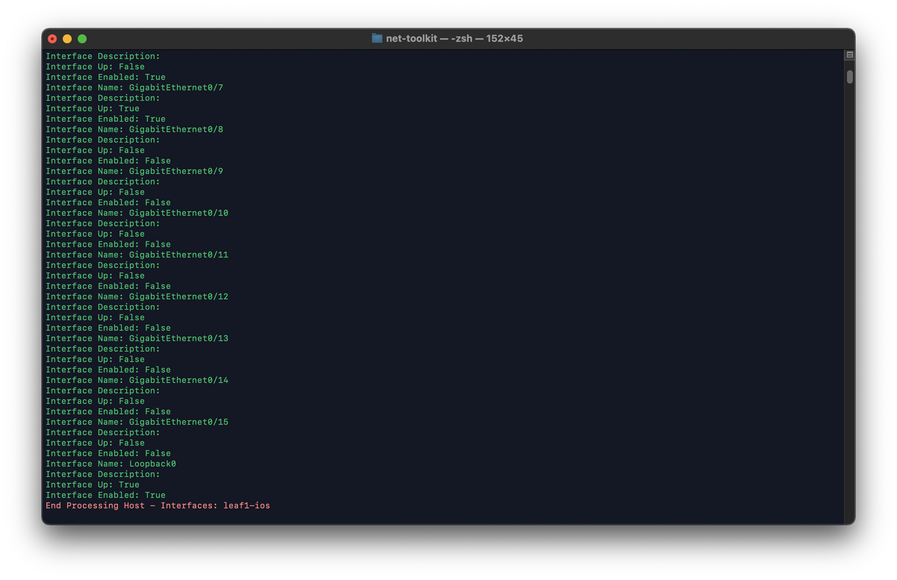

# Network Discovery Toolkit #

By using this toolkit, you will be able to answer and provide information on questions like:

_- What model(s) of Cisco/Juniper/Arista devices do we have?_  
_- What OS version(s) do we have for the same model across the inventory?_  
_- Has someone configured IPv6 on any devices?_  
_- What local usernames are configured on all platforms?_  
_- What devices have the longest uptime?_  
_- What are all our serial numbers which we need for maintenance renewals?_  


## Installation ##

To install the toolkit and the associated modules, please perform the following from within your virtual environment:  

1) Clone the repository to the machine on which you will run the application from:

```git
git clone https://github.com/sbarissonmez/network-discovery.git
cd network-discovery
```

2) Populate your Nornir inventory files:

    - [defaults.yaml](inventory/defaults.yaml)
    - [groups.yaml](inventory/groups.yaml)
    - [hosts.yaml](inventory/hosts.yaml)

See the [Inventory Setup](#inventory-setup) below for more detailed instructions

3) Create the virtual environment to run the application in:

```console
virtualenv --python=`which python3` venv
source venv/bin/activate
```
4) Install the requirements:

```python
pip install -r requirements.txt
```

5) Set two environmental variables, which are used by the application as the default credentials to login to devices:

```bash
export NORNIR_DEFAULT_USERNAME=<someusername>
export NORNIR_DEFAULT_PASSWORD=<somepassword>
```
6) Validate these environmental variables by entering the following command:

```bash
env | grep NORNIR
```
You should see the two environment variables set.

### Inventory Setup ##

You need to populate some YAML files with your particular network inventory. Below is the procedure to 
populate your minimum variables in order to get yourself up and running. 
This toolkit takes advantages of Nornir's inheritance model so we are as efficient as possible.

Throughout the setup, we are going to use the example device inventory below:

| Hostname  |  IP Address | FQDN | Platform|
| ---------- |----------------|---------------|---------|
| leaf1-ios| 172.29.151.3 | lab-iosv-01.lab.nebula.local | ios |
| leaf5-eos| 172.29.151.7 | lab-arista-01.lab.nebula.local | eos |
| leaf4-qfx| 172.29.151.6 | lab-nxos-01.lab.nebula.local | junos |

#### Step 1 - inventory/hosts.yaml file

The first step is to populate the hosts.yaml file with the pertinent information about your hosts.

Below is an example of the hosts.yaml structure for one entry:

```yaml
<fqdn>
    hostname: <fqdn> or <ip address>
    groups:
        - <platform>
```

An extension of this using our example inventory is below, using a mixture of FQDN or IP addresses for the hosts.yaml file:

```yaml
leaf2-ios:
    hostname: 172.29.151.4
    groups:
        - ios
        
leaf4-qfx:
    hostname: 172.29.151.6
    groups:
        - junos
        
leaf6-eos:
    hostname: 172.29.151.8
    groups:
        - eos
```
NOTE: We are only putting in the absolute minimum data to get the toolkit up and running. You will notice that other Nornir inventories
can look markedly different to this and have been enriched with more metadata. This will not be explored in this toolkit.


#### Step 2 - inventory/groups.yaml file

The second step is to populate the groups.yaml file with information regarding each group setup in Step 1. Below is an example of what we
use in our groups.yaml file:

```yaml
<group_name>:
    platform: <platform>
    username: <username>
    password: <password>

```

An extension of this using our example inventory is below, using the groups which were setup in Step 1:

```yaml
ios:
    platform: ios
    username: <*******>
    password: <*******>

junos:
    platform: junos
    username: <*******>
    password: <*******>

nxos:
    platform: nxos
    username: <*******>
    password: <*******>
    
eos:
    platform: eos
    username: <*******>
    password: <*******>
    
iosxr:
    platform: iosxr
    username: <*******>
    password: <*******> 

```

NOTE: You will notice some additional groups in here named `junos` and `iosxr` in here as well.
These were intentionally added to show how you would consistently implement this on other platforms.

You are now setup and ready to use the toolkit!

## Operating Instructions

To run the scripts, please run the following from the command line.

For `network-discovery.py` please run the following:

```python
python network-discovery.py
```

For `collection.py` please run the following:

```python
python collection.py
```

## network-discovery.py - Detailed discovery and config collection

This script uses the Nornir inventory used in the setup and performs two operations:

- Collect the running and startup/candidate configurations for each hosts and
store them using the following directory convention:

```bash
.
|
├── configs
    ├── leaf1-ios
    │   ├── running.txt
    │   └── startup.txt
    ├── leaf2-ios
    │   ├── running.txt
    │   └── startup.txt
    ├── leaf3-qfx
    │   ├── running.txt
    │   └── startup.txt
    ├── leaf4-qfx
    │   ├── running.txt
    │   └── startup.txt
    ├── leaf5-qfx
    │   ├── running.txt
    │   └── startup.txt
    ├── leaf6-qfx
    │   ├── running.txt
    └── └── startup.txt
```

NOTE: The directory structure is dynamically allocated and the appropriate configs are retrieved based on platform.

- Based on the supported list of [NAPALM getters](https://napalm.readthedocs.io/en/latest/support/index.html#getters-support-matrix),
 attempt to retrieve all the getters which are supported on each platform and store them using the following directory convention:  
 
```bash
facts
├── leaf1-ios
    ├── arp_table.json
    ├── bgp_config.json
    ├── bgp_neighbors_detail.json
    ├── bgp_neighbors.json
    ├── environment.json
    ├── facts.json
    ├── interfaces_counters.json
    ├── interfaces_ip.json
    ├── interfaces.json
    ├── ipv6_neighbors_table.json
    ├── lldp_neighbors_detail.json
    ├── lldp_neighbors.json
    ├── mac_address_table.json
    ├── network_instances.json
    ├── ntp_peers.json
    ├── ntp_servers.json
    ├── ntp_stats.json
    ├── optics.json
    ├── snmp_information.json
    └── users.json

```

There is a log file which is dynamically created in the `logs/` directory which maintains the success and failure of each task on each host
and provides a summary of what failed and succeeded. This file follows the naming convention:

_DISCOVERY-LOG-YYYY-MM-DD-HH-MM-SS.txt_  

A collection run on July the 19th, 2022 at 19:59:00 would have the log file name of:  

DISCOVERY-LOG-2022-07-19-19-59-00.txt

From here, you could SCP these files to a central location, or commit them to a central repository for version control and tracking.

## collection.py - Summarised discovery

This script uses the Nornir inventory used in the setup collects key information about all devices using NAPALM getters
and saves them to an Excel workbook. The information collected is:  

- Facts
- Interfaces
- Interfaces IP
- LLDP neighbor
- Users

Some of the information has been omitted from the spreadsheet as this is meant to provide a key summary of the environment.

Once the script has run, it will create an Excel workbook using the following convention:  

_Collection-<customer_name>-YYYY-MM-DD-HH-MM-SS.xlsx_

In the toolkit, you can change the customer name variable in the code under the `create_workbook` function towards the end of the code:  

```
# Assign customer name to Excel file
customer_name = "Customer"
```

There is a log file which is dynamically created in the `logs/` directory which maintains the success and failure of each task on each host
and provides a summary of what failed and succeeded. This file follows the naming convention:

_COLLECTION-LOG-YYYY-MM-DD-HH-MM-SS.txt_  

A collection run on July the 19th, 2022 at 19:57:56 would have the log file name of:  

COLLECTION-LOG-2022-07-19-19-57-56.txt





